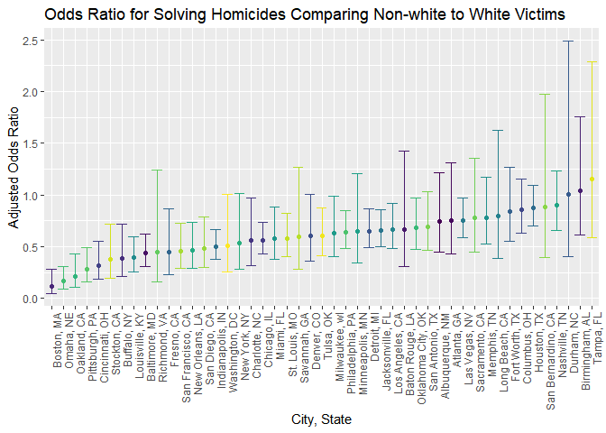
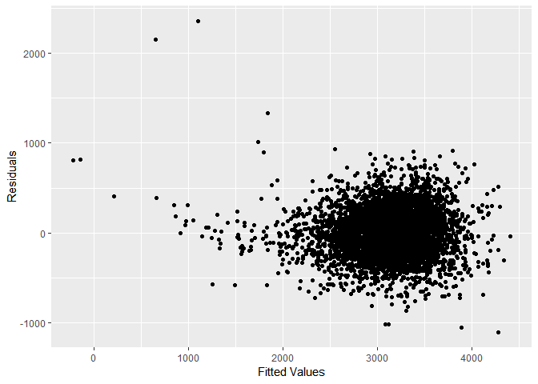
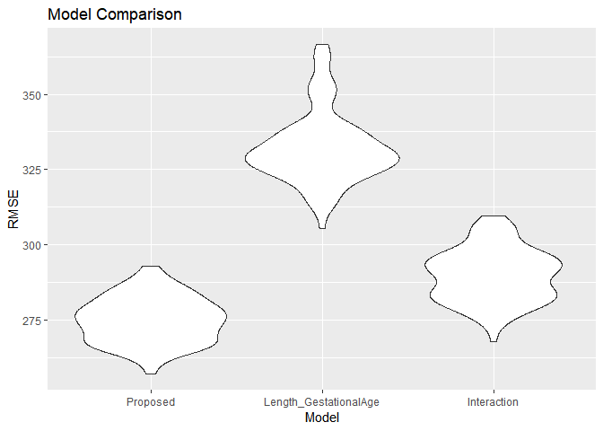

Homework 6
================
Margaret Gacheru
November 21, 2018

Problem 1
=========

This dataset contains information on homicides in 50 large cities across the country.

``` r
url = "https://raw.githubusercontent.com/washingtonpost/data-homicides/master/homicide-data.csv"
homicide_data = read_csv(url)
```

Tidy the dataset by creating a city\_state variable and a binary variable indicating whether the homicide is solved and omitting cities Dallas, TX, Phoenix, AZ, Kansas City, MO, and Tulsa, AL. In addition, modify victim\_race to have categories white and non-white (with white as the reference category) and convert victim\_age to numeric.

``` r
tidy_homicide_data = 
  homicide_data%>%
  mutate(city_state = str_c(city, ", ", state))%>%
  select(city_state, everything())%>%
  filter(!city_state %in% c("Dallas, TX", "Phoenix, AZ", "Kansas City, MO", "Tulsa, AL"))%>%
  mutate(victim_race = ifelse(victim_race == "White", "White", "Non-white"),
         victim_race = forcats::fct_relevel(victim_race, c("White", "Non-white")),
         victim_age = as.numeric(victim_age),
         crime_status = ifelse(disposition == "Closed by arrest", 1, 0))
```

For the city of Baltimore, MD, fit a logistic regression with resolved vs unresolved as the outcome and victim age, sex and race as predictors. Then, obtain the estimate and confidence interval of the adjusted odds ratio for solving homicides comparing non-white victims to white victims keeping all other variables fixed.

``` r
glm_output_md = tidy_homicide_data%>%
  filter(city_state == "Baltimore, MD")%>%
  glm(crime_status ~ victim_age + victim_sex + victim_race, 
      family = binomial(link = "logit"), data = .)%>%
  broom::tidy()%>%
  mutate(conf.low = exp(estimate - 1.96*(std.error)),
         conf.high = exp(estimate + 1.96*(std.error)),
         estimate = exp(estimate))%>%
  select(term, estimate, conf.low, conf.high)%>%
  filter(term == "victim_raceNon-white")%>%
  mutate(term = str_replace(term, "victim_race", "Race: "))

glm_output_md%>%
  knitr::kable(col.names = c("Term", "Adjusted Odds Ratio", "Low CI", "High CI"))
```

| Term            |  Adjusted Odds Ratio|     Low CI|    High CI|
|:----------------|--------------------:|----------:|----------:|
| Race: Non-white |             0.440608|  0.3129079|  0.6204234|

Fit a logistic regression for each of the cities in your dataset, and extract the adjusted odds ratio (and CI) for solving homicides comparing non-white victims to white victims

``` r
glm_output = tidy_homicide_data%>%
  nest(uid:crime_status)%>%
  mutate(models = map(data, ~glm(crime_status ~ victim_age + victim_sex + victim_race, 
                                 family = binomial(link = "logit"), data = .x)),
         models = map(models, broom::tidy))%>%
  select(-data)%>%
  unnest()%>%
  filter(term == "victim_raceNon-white")%>%
  mutate(conf.low = exp(estimate - 1.96*(std.error)),
         conf.high = exp(estimate + 1.96*(std.error)),
         estimate = exp(estimate))%>%
  select(city_state, estimate, conf.low, conf.high)

glm_output%>%
  knitr::kable(col.names = c("city_state", "Adjusted Odds Ratio (Non-white)", "Low CI", "High CI"))
```

| city\_state        |  Adjusted Odds Ratio (Non-white)|     Low CI|    High CI|
|:-------------------|--------------------------------:|----------:|----------:|
| Albuquerque, NM    |                        0.7414698|  0.4512868|  1.2182443|
| Atlanta, GA        |                        0.7528020|  0.4315063|  1.3133316|
| Baltimore, MD      |                        0.4406080|  0.3129079|  0.6204234|
| Baton Rouge, LA    |                        0.6676289|  0.3127439|  1.4252185|
| Birmingham, AL     |                        1.0392783|  0.6150483|  1.7561211|
| Boston, MA         |                        0.1145531|  0.0471531|  0.2782939|
| Buffalo, NY        |                        0.3898879|  0.2127526|  0.7145036|
| Charlotte, NC      |                        0.5575017|  0.3207914|  0.9688794|
| Chicago, IL        |                        0.5620844|  0.4311321|  0.7328123|
| Cincinnati, OH     |                        0.3183560|  0.1839996|  0.5508195|
| Columbus, OH       |                        0.8547029|  0.6339868|  1.1522590|
| Denver, CO         |                        0.6018870|  0.3589787|  1.0091626|
| Detroit, MI        |                        0.6512456|  0.4877782|  0.8694953|
| Durham, NC         |                        1.0028175|  0.4041085|  2.4885469|
| Fort Worth, TX     |                        0.8378356|  0.5545077|  1.2659311|
| Fresno, CA         |                        0.4478015|  0.2306060|  0.8695617|
| Houston, TX        |                        0.8726047|  0.6986847|  1.0898176|
| Indianapolis, IN   |                        0.5045560|  0.3817941|  0.6667909|
| Jacksonville, FL   |                        0.6581751|  0.5023197|  0.8623880|
| Las Vegas, NV      |                        0.7554159|  0.5864306|  0.9730958|
| Long Beach, CA     |                        0.7939031|  0.3876546|  1.6258857|
| Los Angeles, CA    |                        0.6658424|  0.4828459|  0.9181936|
| Louisville, KY     |                        0.3919136|  0.2589809|  0.5930794|
| Memphis, TN        |                        0.7823191|  0.5238191|  1.1683866|
| Miami, FL          |                        0.5762370|  0.3772438|  0.8801975|
| Milwaukee, wI      |                        0.6323892|  0.4033912|  0.9913854|
| Minneapolis, MN    |                        0.6457029|  0.3447349|  1.2094287|
| Nashville, TN      |                        0.8985913|  0.6533730|  1.2358427|
| New Orleans, LA    |                        0.4659337|  0.2947205|  0.7366105|
| New York, NY       |                        0.5314592|  0.2793572|  1.0110671|
| Oakland, CA        |                        0.2129779|  0.1043603|  0.4346441|
| Oklahoma City, OK  |                        0.6812533|  0.4780242|  0.9708841|
| Omaha, NE          |                        0.1689228|  0.0935132|  0.3051432|
| Philadelphia, PA   |                        0.6438263|  0.4862491|  0.8524692|
| Pittsburgh, PA     |                        0.2815606|  0.1607457|  0.4931788|
| Richmond, VA       |                        0.4474146|  0.1616764|  1.2381512|
| San Antonio, TX    |                        0.6893496|  0.4613199|  1.0300939|
| Sacramento, CA     |                        0.7807364|  0.4486304|  1.3586894|
| Savannah, GA       |                        0.5964045|  0.2800315|  1.2702083|
| San Bernardino, CA |                        0.8801457|  0.3928312|  1.9719832|
| San Diego, CA      |                        0.4833560|  0.2976277|  0.7849839|
| San Francisco, CA  |                        0.4582812|  0.2904504|  0.7230896|
| St. Louis, MO      |                        0.5770478|  0.4059333|  0.8202928|
| Stockton, CA       |                        0.3757201|  0.1964244|  0.7186762|
| Tampa, FL          |                        1.1588262|  0.5870394|  2.2875435|
| Tulsa, OK          |                        0.6024687|  0.4130931|  0.8786605|
| Washington, DC     |                        0.5100815|  0.2577041|  1.0096200|

Create a plot that shows the estimated ORs and CIs for each city and organize cities according to estimated OR.

``` r
glm_output%>%
  ggplot(aes(reorder(city_state, estimate), estimate, color = city_state))+
  geom_point()+
  geom_errorbar(aes(ymin = conf.low, ymax = conf.high))+
  labs(
    y = "Adjusted Odds Ratio",
    x = "City, State",
    title = "Odds Ratio for Solving Homicides Comparing Non-white to White Victims")+
  viridis::scale_color_viridis(discrete = TRUE)+
  theme(legend.position = "none", 
        axis.text.x = element_text(angle = 90, hjust = 1))
```



For a majority of the cities, the estimate odds ratio for solving homicides for nonwhites in comparison to white victims is less than one. In addition, for about 50% of the cities, the odds ratio confidence interval does not include 1, indicating that the true odds for solving homicides for non-whites is significantly different from the odds for whites (in this case, the odds for nonwhites is lower).

Problem 2
=========

Load and clean the data for regression analysis

``` r
birthweight_data = read_csv("./data/birthweight.csv")
```

    ## Parsed with column specification:
    ## cols(
    ##   .default = col_integer(),
    ##   gaweeks = col_double(),
    ##   ppbmi = col_double(),
    ##   smoken = col_double()
    ## )

    ## See spec(...) for full column specifications.

``` r
birthweight_data = birthweight_data%>%
  mutate(babysex = as.factor(babysex),
         frace = as.factor(frace),
         malform = as.factor(malform),
         mrace = as.factor(mrace))
```

During the data cleaning process, one key observation is made:

1.  The variables "pnumsga"" and "pnumlbw" have all entries equal to 0

``` r
summary(birthweight_data$pnumsga)
```

    ##    Min. 1st Qu.  Median    Mean 3rd Qu.    Max. 
    ##       0       0       0       0       0       0

``` r
summary(birthweight_data$pnumlbw)
```

    ##    Min. 1st Qu.  Median    Mean 3rd Qu.    Max. 
    ##       0       0       0       0       0       0

As a starting point, we can fit the preliminary model based on factors that are believed to have an influence in low birth weights in the scientific world. Smoking is well known to have a negative impact on birth weights. Other factors that have been hypothesized to have an impact include baby's gender, parents' genes based on race, stress (income could be a potential replacement), number of prior low weight births, mother's age, size of parents, diabetes, high blood pressure, length of pregnancy, maternal's weight at the last week of gestation, and high risk pregnancy. We can use the variables that provide similar information.

``` r
modified_birthweight_data = birthweight_data%>%
  mutate(babysex_male = ifelse(babysex == "1", "1", "0"),
         frace_black = ifelse(frace == "2", "1", "0"),
         mrace_black = ifelse(mrace == "2", "1", "0"))

fit = lm(bwt ~ bhead + blength + babysex_male + delwt  + frace_black + 
           mrace_black + fincome + gaweeks + malform + mheight + momage + 
           parity + ppbmi + smoken + wtgain, data = modified_birthweight_data)

summary(fit)
```

    ## 
    ## Call:
    ## lm(formula = bwt ~ bhead + blength + babysex_male + delwt + frace_black + 
    ##     mrace_black + fincome + gaweeks + malform + mheight + momage + 
    ##     parity + ppbmi + smoken + wtgain, data = modified_birthweight_data)
    ## 
    ## Residuals:
    ##      Min       1Q   Median       3Q      Max 
    ## -1096.88  -183.46    -4.48   174.99  2383.25 
    ## 
    ## Coefficients:
    ##                 Estimate Std. Error t value Pr(>|t|)    
    ## (Intercept)   -6616.4367   657.8509 -10.058  < 2e-16 ***
    ## bhead           130.0155     3.4580  37.598  < 2e-16 ***
    ## blength          75.3669     2.0257  37.206  < 2e-16 ***
    ## babysex_male1   -27.3546     8.4826  -3.225  0.00127 ** 
    ## delwt            -0.1325     2.5852  -0.051  0.95913    
    ## frace_black1     20.4615    43.5273   0.470  0.63832    
    ## mrace_black1   -141.7822    43.5593  -3.255  0.00114 ** 
    ## fincome           0.4452     0.1776   2.506  0.01223 *  
    ## gaweeks          11.9030     1.4682   8.107 6.67e-16 ***
    ## malform1         19.7638    70.8096   0.279  0.78017    
    ## mheight          14.5201    10.3009   1.410  0.15873    
    ## momage            0.5730     1.1904   0.481  0.63026    
    ## parity           98.4848    40.5923   2.426  0.01530 *  
    ## ppbmi             8.9982    14.8966   0.604  0.54585    
    ## smoken           -4.5104     0.5842  -7.721 1.43e-14 ***
    ## wtgain            4.2862     2.6143   1.640  0.10117    
    ## ---
    ## Signif. codes:  0 '***' 0.001 '**' 0.01 '*' 0.05 '.' 0.1 ' ' 1
    ## 
    ## Residual standard error: 273.3 on 4326 degrees of freedom
    ## Multiple R-squared:  0.7163, Adjusted R-squared:  0.7153 
    ## F-statistic:   728 on 15 and 4326 DF,  p-value: < 2.2e-16

With an initial model, we can use criterion based procedures to determine the best model from the subset of variables

``` r
best <- function(model, ...) 
{
  subsets <- regsubsets(formula(model), model.frame(model), ...)
  subsets <- with(summary(subsets),
                  cbind(p = as.numeric(rownames(which)), which, rss, rsq, adjr2, cp, bic))
  
  return(subsets)
}  


# Select the 'best' model of all subsets 
round(best(fit, nbest = 1),2)
```

    ##   p (Intercept) bhead blength babysex_male1 delwt frace_black1
    ## 1 1           1     1       0             0     0            0
    ## 2 2           1     1       1             0     0            0
    ## 3 3           1     1       1             0     0            0
    ## 4 4           1     1       1             0     1            0
    ## 5 5           1     1       1             0     1            0
    ## 6 6           1     1       1             0     1            0
    ## 7 7           1     1       1             0     1            0
    ## 8 8           1     1       1             1     1            0
    ##   mrace_black1 fincome gaweeks malform1 mheight momage parity ppbmi smoken
    ## 1            0       0       0        0       0      0      0     0      0
    ## 2            0       0       0        0       0      0      0     0      0
    ## 3            1       0       0        0       0      0      0     0      0
    ## 4            1       0       0        0       0      0      0     0      0
    ## 5            1       0       1        0       0      0      0     0      0
    ## 6            1       0       1        0       0      0      0     0      1
    ## 7            1       0       1        0       0      0      0     1      1
    ## 8            1       0       1        0       0      0      0     1      1
    ##   wtgain       rss  rsq adjr2      cp      bic
    ## 1      0 503092368 0.56  0.56 2398.26 -3529.91
    ## 2      0 362831534 0.68  0.68  522.21 -4940.65
    ## 3      0 349629197 0.69  0.69  347.43 -5093.21
    ## 4      0 338816265 0.70  0.70  204.65 -5221.24
    ## 5      0 333471234 0.71  0.71  135.08 -5281.91
    ## 6      0 329141332 0.71  0.71   79.10 -5330.28
    ## 7      0 325082470 0.71  0.71   26.76 -5375.78
    ## 8      0 324322307 0.72  0.71   18.58 -5377.57

Looking at the highest adjusted R-squared and lowest BIC & Cp, we are left with a model with baby's head circumference, baby's length at birth, baby's sex, mother's race (black or not), mother's weight at delivery, gestational age, mother's pre-pregnancy BMI, and average number of cigarettes smoked per day during pregnancy as the main effects.

Show a plot of model residuals against fitted values

``` r
library(modelr)

fit = lm(bwt ~ bhead + blength + babysex_male + delwt + mrace_black + gaweeks +
           ppbmi + smoken, data = modified_birthweight_data)

modified_birthweight_data %>%
  gather_predictions(fit)%>%
  add_residuals(fit)%>%
  ggplot(aes(x = pred, y = resid))+
  geom_point()+
  labs( x= "Fitted Values",
        y = "Residuals")
```



The residuals vs. fitted values plot can be used to assess constant variance in the data. In this case, we observe a cluster around 0 towards the higher end of the fitted values. However, towards the lower end of the fitted values, we observe a slight curve and the residuals are not scattered around 0. This slightly violates constant variance assumption.

Compare your model to two others:

1.  One using length at birth and gestational age as predictors (main effects only)

2.  One using head circumference, length, sex, and all interactions (including the three-way interaction) between these

``` r
cv_df =
  crossv_mc(modified_birthweight_data, 100) %>% 
  mutate(train = map(train, as_tibble),
         test = map(test, as_tibble))

cv_df = 
  cv_df %>% 
  mutate(model1 = map(train, ~lm(bwt ~ bhead + blength + babysex_male + delwt +
                                   mrace_black + gaweeks + ppbmi + smoken, data = as_tibble(.x))),
         model2 = map(train, ~lm(bwt ~ blength + gaweeks, data = .x)),
         model3 = map(train, ~lm(bwt ~ bhead + blength + babysex_male + 
                                   bhead*blength + bhead*babysex_male + blength*babysex_male, data = .x)))%>% 
  mutate(rmse_model1 = map2_dbl(model1, test, ~rmse(model = .x, data = .y)),
         rmse_model2 = map2_dbl(model2, test, ~rmse(model = .x, data = .y)),
         rmse_model3 = map2_dbl(model3, test, ~rmse(model = .x, data = .y)))


cv_df %>% 
  select(starts_with("rmse")) %>% 
  gather(key = model, value = rmse) %>% 
  mutate(model = str_replace(model, "rmse_", ""),
         model = fct_inorder(model)) %>% 
  ggplot(aes(x = model, y = rmse)) + 
  geom_violin()+
  labs(x = "Model",
       y = "RMSE",
       title = "Model Comparison")+
  scale_x_discrete(labels = c("Proposed", "Length_GestationalAge", "Interaction"))
```



Based on RMSE, my proposed model has a better predictive ability that the comparison models. The models with more predictors and complexity (interaction) performed better than the simple two-predictor model. Among these three models, I would pick the proposed model for prediction purposes. However, in general, the proposed model might not be the optimal model, which was somewhat indicated by the residuals vs. fitted graph.
